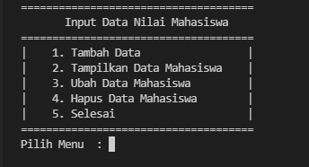
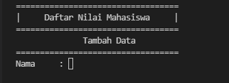
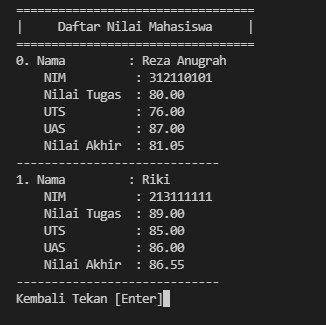
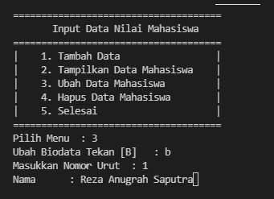
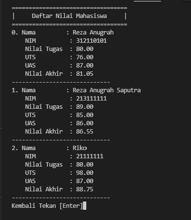
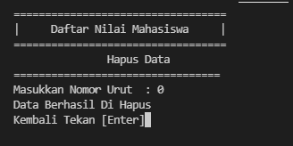
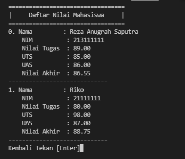

# labspy06
Repository ini adalah isi praktikum dalam penggunaan function pada python

# Pada repository Labspy06 ini, saya akan menjelaskan hasil praktikum mengenai penggunaan function didalam python berikut dengan flowchartnya.
- Dibawah ini adalah flowchart peogram nya


- Dibawah ini adalah code untuk meng-import, karena kita akan gunakan system, untuk mendapatkan clear screen yang ada dalam system os, jika kita perhatikan, disetiap function yang kita buat, terdapat syntax system('cls'), syntax tersebut lah yang kita gunakan dalam hal import system ini. maka kita import terlebih dahulu, berikut code nya:
```python
from os import system
```
- Dibawah ini code untuk membuat list yang akan kita gunakan, karena program yang akan kita buat adalah program daftar nilai mahasiswa, maka kita buat terlebih dahulu list nya
```python
s_nama = []
s_nim = []
s_tugas = []
s_uts = []
s_uas = []
s_akhir = []
```
- Dibawah ini code untuk membuat fungsi judul, karena didalam fungsi, kita dapat memanggil fungsi tersebut berkali-kali tanpa harus mengulang codingannya, hanya perlu dengan cara memanggil fungsi ( contohnya: fungsi() ), setiap kita akan membuat fungsi, maka harus di awali dengan def dan diikuti dengan nama fungsi yang akan kita buat dan gunakan selanjutnya.
```python
def judul():
    print('==================================')
    print('|     Daftar Nilai Mahasiswa     |')
    print('==================================')
```
- Dibawah adalah code untuk membuat fungsi menu
```python
def menu():
    system('cls')
    print('=====================================')
    print('Input Data Nilai Mahasiswa'.center(40))
    print('=====================================')
    print('|    1. Tambah Data                 |')
    print('|    2. Tampilkan Data Mahasiswa    |')
    print('|    3. Ubah Data Mahasiswa         |')
    print('|    4. Hapus Data Mahasiswa        |')
    print('|    5. Selesai                     |')
    print('=====================================')
    choose = input('Pilih Menu  : ')
    if choose == '1':
        tambah()
    elif choose == '2':
        tampilkan()
    elif choose == '3':
        ubah()
    elif choose == '4':
        hapus()
    elif choose == '5':
        selesai()
    else:
        tidak = input('Menu Tidak Ada')
        system('cls')
        menu()
```
- berikut tampilan ketika program dijalankan

- dengan ketentuan jika kita menekan angka 1 pada keyboard, maka akan menambah data, dan angka 2 akan menampilkan data, angka 3 akan meng-ubah data (nama), dan angka 4 akan menghapus data yang kita inginkan
- code dibawah untuk membuat fungsi tambah yang ada dalam program ini
```python
def tambah():
    system('cls')
    judul()
    print('Tambah Data'.center(40))
    print('==================================')
    nama = input('Nama     : ')
    s_nama.append(nama)
    nim = input('NIM       : ')
    s_nim.append(nim)

    system('cls')
    judul()
    print('Tambah Data'.center(40))
    print('==================================')
    tugas = float(input('Nilai Tugas    : '))
    s_tugas.append(tugas)

    uts = float(input('Nilai UTS        : '))
    s_uts.append(uts)

    uas = float(input('Nilai UAS        : '))
    s_uas.append(uas)

    total = tugas * 0.30 + uts * 0.35 + uas * 0.35
    s_akhir.append(total)
    print('Data Tersimpan'.center(40))
    kembali = input('Kembali [Enter]')
    menu()
	```
- berikut tampilan ketika program dijalankan

- Code dibawah adalah untuk membuat fungsi tampilkan yang ada dalam program ini
```python
def tampilkan():
    system('cls')
    judul()

    for i in range(len(s_nim)):

        print('%d. Nama         : %s'%(i+0, s_nama[i]))
        print('    NIM          : %s'%s_nim[i])
        print('    Nilai Tugas  : %.2f'%s_tugas[i])
        print('    UTS          : %.2f'%s_uts[i])
        print('    UAS          : %.2f'%s_uas[i])
        print('    Nilai Akhir  : %.2f'%s_akhir[i])
        print('-----------------------------')
    kembali = input('Kembali Tekan [Enter]')
    menu()
	```
- berikut tampilan ketika program dijalankan

- Code dibawah adalah untuk membuat fungsi merubah nama pada program ini, dengan ketentuan jika kita menekan angka 3 pada keyboard, maka akan muncul konfirmasi dan mengharuskan kita untuk menekan huruf B pada keyboard, dan setelah itu juga kita akan di haruskan menginputkan nomor urut list yang ada di program yang telah kita tampung, dan list tersebut dimulai dengan angka 0 adalah untuk list pertama, dan seterusnya
```python
def ubah():
    rubah = input('Ubah Biodata Tekan [B]   : ')
    if rubah == 'B' or rubah == 'b':
        i = int(input('Masukkan Nomor Urut  : '))
        if (i > len(s_nim[i])):
            print('Nomor Urut Salah')
        else:
            namabaru = input('Nama      : ')
            s_nama[i] = namabaru
    kembali = input('Kembali Tekan [Enter]')
    menu()
	```
- berikut tampilan ketika program dijalankan

- berikut tampilan ketika program dijalankan, setelah adanya perubahan data pada nomor urut 1 dan penambahan data untuk nomor urut 2

- Code dibawah adalah untuk membuat fungsi hapus data yang sudah tertampung di dalam program, sama hal nya dengan fungsi ubah, kita harus memasukkan nomor urut list data yang ada di dalam program, yang kemudian akan di eksekusi penghapusan data. jika nomor urut yang kita inputkan ternyata tidak ada di dalam program, maka akan muncul peringatan NIM Tidak Ada.
```python
def hapus():
    system('cls')
    judul()
    print('Hapus Data'.center(40))
    print('=================================')
    i = int(input('Masukkan Nomor Urut  : '))

    if (i > len(s_nim[i])):
        tidak = input('NIM Tidak Ada')
        hapus()
    
    else:
        s_nim.remove(s_nim[i])
        s_nama.remove(s_nama[i])
        s_tugas.remove(s_tugas[i])
        s_uts.remove(s_uts[i])
        s_uas.remove(s_uas[i])
        s_akhir.remove(s_akhir[i])

    print('Data Berhasil Di Hapus')
    kembali = input('Kembali Tekan [Enter]')
    menu()
	```
- berikut tampilan ketika program dijalankan

- berikut tampilan ketika program dijalankan, dan menghapus data pada nomor urut 0 maka akan menghasilkan tampilan seperti dibawah

- Code dibawah untuk fungsi pilihan selesai, jika kita sudah selesai, dan menekan angka 5 pada keyboard sesuai ketentuan pada fungsi menu, maka akan menyelesaikan program, tetapi tidak akan menutup program
```python
def selesai():
    system('cls')
    menu()
menu()
```
# Sekian praktikum function pada python ini di buat, Terima kasih.